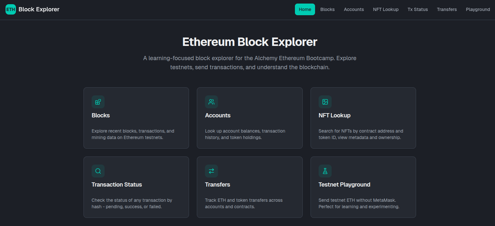

# ⛓️ Ethereum Block Explorer

[](https://nextjs.org/)
[](https://reactjs.org/)
[](https://tailwindcss.com/)
[](https://www.alchemy.com/)
[](https://www.typescriptlang.org/)
[](https://opensource.org/licenses/MIT)

A comprehensive Ethereum blockchain explorer built for **Week 3 of the Alchemy Ethereum Bootcamp**. Explore blocks, transactions, accounts, NFTs, and send ETH programmatically - easier than MetaMask! 🚀🔍💸

## 🌟 Overview

This block explorer provides a complete set of tools to interact with Ethereum:

### 🏗️ **Core Features**

1. **🔍 Block Explorer** - Browse latest blocks and their transactions
2. **👤 Account Lookup** - Check balances and transaction history
3. **🎨 NFT Metadata** - Fetch NFT details by contract address and token ID
4. **📊 Transaction Status** - Track transaction confirmations and receipts
5. **💸 Transfer History** - View asset transfers by wallet address
6. **🚀 Testnet Playground** - Send ETH programmatically (testnet supported)

### ⚡ **Why Use Code Over MetaMask?**

- ✅ **No popups** - Transactions execute instantly
- ✅ **Batch operations** - Send multiple transactions with ease
- ✅ **Automation** - Integrate into scripts and workflows
- ✅ **Testing** - Perfect for testnet experimentation
- ✅ **Reliability** - No browser extension dependencies

## 🧩 Architecture & Technology Stack

### **Frontend**

- **Next.js 16** ⚡: React framework with App Router
- **React 19** ⚛️: Latest React with concurrent features
- **Tailwind CSS 4** 💄: Utility-first CSS framework
- **shadcn/ui** 🎨: Accessible component library
- **TypeScript 5.7** 📝: Type-safe development

### **Blockchain Integration**

- **Alchemy SDK 3.x** ⚗️: Enhanced Ethereum API access
- **ethers.js 6.x** 🔗: Ethereum utilities and wallet management

### **Development Tools**

- **pnpm** 📦: Fast, disk space efficient package manager
- **ESLint** 🔍: Code quality enforcement
- **PostCSS** 🎨: CSS processing with Tailwind

### 📸 **Quick Demo**



*Home page featuring all the explorer tools: Blocks, Accounts, NFT Lookup, Transaction Status, Transfers, and Testnet Playground.*

## 🛠️ Setup

### Prerequisites

- 🟢 Node.js 18.0 or later
- 📦 pnpm (recommended) or npm
- 🔑 [Alchemy Account](https://www.alchemy.com/) (free tier works!)

### Installation

1. 📥 Clone this repository:

   ```bash
   git clone git@github.com:ernanibmurtinho/alchemy-bootcamp-week3.git
   cd alchemy-bootcamp-week3
   ```

2. 🚀 Install dependencies:

   ```bash
   pnpm install
   ```

3. 🔐 Set up environment variables:

   Create a `.env.local` file:

   ```bash
   # Alchemy API Key (required - server-side only)
   ALCHEMY_API_KEY=your_alchemy_api_key_here

   # Network (optional, defaults to mainnet)
   # Options: mainnet, sepolia, goerli
   ALCHEMY_NETWORK=mainnet
   ```

   **⚠️ Important:** The API key is only used server-side in API routes for security.

4. ▶️ Start the development server:

   ```bash
   pnpm dev
   ```

5. 🌐 Open your browser at [http://localhost:3000](http://localhost:3000)

## 🚀 Usage

### **Pages Overview**

| Page | Route | Description |
| ---- | ----- | ----------- |
| 🏠 Home | `/` | Feature cards linking to all sections |
| 🔍 Blocks | `/blocks` | Browse latest blocks with transaction counts |
| 👤 Accounts | `/accounts` | Look up balances and transaction history |
| 🎨 NFT Lookup | `/nft-lookup` | Fetch NFT metadata by contract and token ID |
| 📊 Tx Status | `/transaction-status` | Check transaction status by hash |
| 💸 Transfers | `/transfers` | View asset transfers for any wallet |
| 🚀 Playground | `/playground` | Send testnet ETH programmatically |

### **Page Details**

#### **Block Explorer** 🔍

- View latest block numbers and details
- Browse transactions within blocks
- Navigate between blocks
- See gas usage and timestamps

#### **Accounts Page** 👤

- Enter any Ethereum address
- View ETH balance in real-time
- See transaction history
- Detect if address is a contract

#### **NFT Lookup** 🎨

- Enter contract address and token ID
- Fetch complete NFT metadata
- View token name, description, and attributes
- Display token image when available

#### **Transaction Status** 📊

- Enter transaction hash
- View confirmation status
- See gas used and transaction details
- Track pending transactions

#### **Transfer History** 💸

- Enter wallet address
- View all transfers received
- Filter by token type (ERC-20, ERC-721, ERC-1155)
- See timestamps and values

## 🌐 Using Testnet

### Why Testnet?

Testnets let you experiment **without spending real ETH**. Perfect for learning!

### Testnet Setup

1. 🔑 Create a **testnet** API key in [Alchemy Dashboard](https://dashboard.alchemy.com/)

2. 🔄 Update `.env.local`:

   ```bash
   ALCHEMY_API_KEY=your_testnet_api_key
   ALCHEMY_NETWORK=sepolia
   ```

3. 🔄 Restart the dev server

### Getting Testnet ETH

| Network | Faucets |
| ------- | ------- |
| **Sepolia** | [Alchemy Faucet](https://sepoliafaucet.com/) • [PoW Faucet](https://sepolia-faucet.pk910.de/) |
| **Holesky** | [Holesky Faucet](https://holesky-faucet.pk910.de/) |

## 💸 Sending ETH Transactions

### Example: Send ETH Programmatically

The playground page (`/playground`) lets you send testnet ETH. Here's how it works under the hood:

```typescript
import { Alchemy, Network } from 'alchemy-sdk';
import { Wallet, parseEther } from 'ethers';

const settings = {
  apiKey: process.env.ALCHEMY_API_KEY,
  network: Network.ETH_SEPOLIA, // Use testnet!
  connectionInfoOverrides: {
    skipFetchSetup: true, // Required for server-side
  },
};

const alchemy = new Alchemy(settings);

export async function sendETH(toAddress: string, amountInETH: number, privateKey: string) {
  try {
    const provider = await alchemy.config.getProvider();
    const wallet = new Wallet(privateKey, provider);
    
    const tx = await wallet.sendTransaction({
      to: toAddress,
      value: parseEther(amountInETH.toString()),
    });
    
    console.log('Transaction sent:', tx.hash);
    const receipt = await tx.wait();
    
    return { success: true, hash: tx.hash, block: receipt?.blockNumber };
  } catch (error) {
    return { success: false, error: (error as Error).message };
  }
}
```

### Usage

```typescript
const result = await sendETH(
  '0xRECIPIENT_ADDRESS_HERE',  // Recipient address
  0.1,                          // Amount in ETH
  'your_private_key'            // ⚠️ Never commit this!
);
```

## 📁 Project Structure

```
alchemy-bootcamp-week3/
├── app/                        # Next.js App Router pages
│   ├── page.tsx               # Home page with feature cards
│   ├── layout.tsx             # Root layout with navbar
│   ├── globals.css            # Global styles and theme
│   ├── blocks/
│   │   └── page.tsx           # Block explorer page
│   ├── accounts/
│   │   └── page.tsx           # Account lookup page
│   ├── nft-lookup/
│   │   └── page.tsx           # NFT metadata page
│   ├── transaction-status/
│   │   └── page.tsx           # Transaction status page
│   ├── transfers/
│   │   └── page.tsx           # Transfer history page
│   ├── playground/
│   │   └── page.tsx           # Testnet playground page
│   └── api/                   # API routes (server-side)
│       ├── blocks/
│       │   └── with-transactions/route.ts
│       ├── transaction/route.ts
│       ├── transfers/route.ts
│       ├── account/
│       │   ├── info/route.ts
│       │   └── transactions/route.ts
│       └── nft/
│           └── metadata/route.ts
├── components/                 # React components
│   ├── navbar.tsx             # Navigation component
│   ├── send-eth-form.tsx      # Send ETH form
│   └── ui/                    # shadcn/ui components
├── lib/                       # Utilities
│   ├── alchemy.ts             # Alchemy SDK setup (server-only)
│   ├── format-utils.ts        # Formatting helpers
│   └── utils.ts               # General utilities
├── .env.local                 # Environment variables (create this)
├── package.json               # Dependencies
└── README.md                  # This file
```

## 🔌 API Routes

All Alchemy SDK calls are made server-side through API routes to keep the API key secure:

| Endpoint | Method | Description |
| -------- | ------ | ----------- |
| `/api/blocks/with-transactions` | GET | Fetch latest blocks with transaction data |
| `/api/transaction` | GET | Get transaction details by hash |
| `/api/transfers` | GET | Fetch asset transfers for an address |
| `/api/account/info` | GET | Get account balance and transaction count |
| `/api/account/transactions` | GET | Get recent transactions for an account |
| `/api/nft/metadata` | GET | Fetch NFT metadata |

## 📖 Alchemy SDK vs ethers.js

The Alchemy SDK wraps `ethers.js` with enhanced functionality:

| Operation | ethers.js | Alchemy SDK |
| --------- | --------- | ----------- |
| Get block number | `provider.getBlockNumber()` | `alchemy.core.getBlockNumber()` |
| Get block | `provider.getBlock(n)` | `alchemy.core.getBlock(n)` |
| Get balance | `provider.getBalance(addr)` | `alchemy.core.getBalance(addr)` |
| NFT metadata | ❌ Not available | `alchemy.nft.getNftMetadata()` |
| Asset transfers | ❌ Not available | `alchemy.core.getAssetTransfers()` |

Need full ethers.js access?

```typescript
const ethersProvider = await alchemy.config.getProvider();
```

## 🔗 Resources

### **Documentation**

- 📚 [Alchemy SDK Quickstart](https://docs.alchemy.com/reference/alchemy-sdk-quickstart?a=eth-bootcamp)
- 📖 [Alchemy API Overview](https://docs.alchemy.com/reference/api-overview?a=eth-bootcamp)
- 🔗 [ethers.js Documentation](https://docs.ethers.io/)
- ⚡ [Next.js Documentation](https://nextjs.org/docs)
- 🎨 [shadcn/ui Components](https://ui.shadcn.com/)
- 💄 [Tailwind CSS](https://tailwindcss.com/docs)

### **Block Explorers**

- 🔍 [Etherscan (Mainnet)](https://etherscan.io/)
- 🧪 [Sepolia Etherscan](https://sepolia.etherscan.io/)

## 🚨 Security Best Practices

| Rule | Description |
| ---- | ----------- |
| 🔐 **Never commit private keys** | Use `.env.local` and add to `.gitignore` |
| 🧪 **Use testnet first** | Always test transactions on testnet |
| 🔒 **Server-side API keys** | API keys are only used in API routes |
| ✅ **Validate addresses** | Check address format before transactions |
| 💰 **Check balances** | Verify sufficient funds before sending |
| ⚠️ **Handle errors** | Implement proper error handling |

## 🧪 Development

### Available Scripts

```bash
# Start development server
pnpm dev

# Build for production
pnpm build

# Start production server
pnpm start

# Run linting
pnpm lint
```

### Testing Your Setup

```bash
# Verify Alchemy connection
curl -X POST https://eth-mainnet.g.alchemy.com/v2/YOUR_API_KEY \
  -H "Content-Type: application/json" \
  -d '{"jsonrpc":"2.0","method":"eth_blockNumber","params":[],"id":1}'
```

### Server-Side Configuration Note

When using Alchemy SDK in Next.js API routes, add this configuration to avoid fetch issues:

```typescript
const settings = {
  apiKey: process.env.ALCHEMY_API_KEY,
  network: Network.ETH_MAINNET,
  connectionInfoOverrides: {
    skipFetchSetup: true, // Required for server-side environments
  },
};
```

## 🤝 Contributing

1. Fork the repository
2. Create a feature branch: `git checkout -b feature/new-feature`
3. Make your changes
4. Commit: `git commit -m 'Add new feature'`
5. Push: `git push origin feature/new-feature`
6. Submit a pull request

## 📄 License

This project is licensed under the MIT License - see the [LICENSE](LICENSE) file for details.

---

**Built with ❤️ for the Alchemy Ethereum Bootcamp Week 3**
